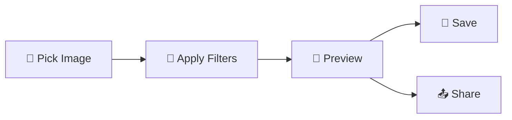

# 📸 PhotoStore – Simple Photo Editing App (Kotlin + Jetpack Compose)

A lightweight **photo editing application** built with **Kotlin** and **Jetpack Compose**, designed to let users quickly adjust brightness, contrast, saturation, and hue of an image — and save or share it instantly.  

---

## ✨ Features

- **Pick Image** from device gallery.
- **Live Preview Filters**:
  - Brightness
  - Contrast
  - Saturation
  - Hue
- **Compare Mode** – View before & after changes.
- **Reset** adjustments to original image.
- **Save Edited Image** to device storage.
- **Share** directly to social apps.
- **Clean UI** using **Material 3**.

---

## 📂 Project Structure

```plaintext
com.example.photostore
│
├── presentation
│   ├── EditActivity.kt         # Main editing screen
│   ├── EnhancedImageDisplay.kt # Displays image with filters
│   ├── EnhancedTopBar.kt       # Top App Bar with Save
│   ├── EnhancedBottomBar.kt    # Bottom Bar with tools
│   ├── FilterSliders.kt        # Sliders for adjustments
│   └── Utils.kt                # Helper methods
└── ...
```


---

## 🛠 Tech Stack

- **Language**: Kotlin
- **UI**: Jetpack Compose + Material 3
- **Image Loading**: [Coil](https://coil-kt.github.io/coil/)
- **Image Processing**: Android `ColorMatrix`
- **Permissions**: AndroidX Activity/Compose APIs

---

## 📷 Screenshots


---

## 🚀 Getting Started

### 1️⃣ Prerequisites
- Android Studio **Giraffe** or newer
- **Android SDK 24+** (minSdk)
- Kotlin **1.9+**

### 2️⃣ Clone the Repository
```bash
https://github.com/vedantsagolale12/PhotoStore.git
cd photostore
```

3️⃣ Open in Android Studio
1. Select "Open an Existing Project"
2. Sync Gradle

4️⃣ Run the App
1. Connect an Android device or start an emulator
2. Click ▶ Run

### 📦 APK Build
To generate a release APK:
./gradlew assembleRelease

The APK will be located in:
app/build/outputs/apk/release/

### ### 📌 How It Works



### 📜 License
This project is licensed under the MIT License – feel free to use

### author - Vedant Sagolale


